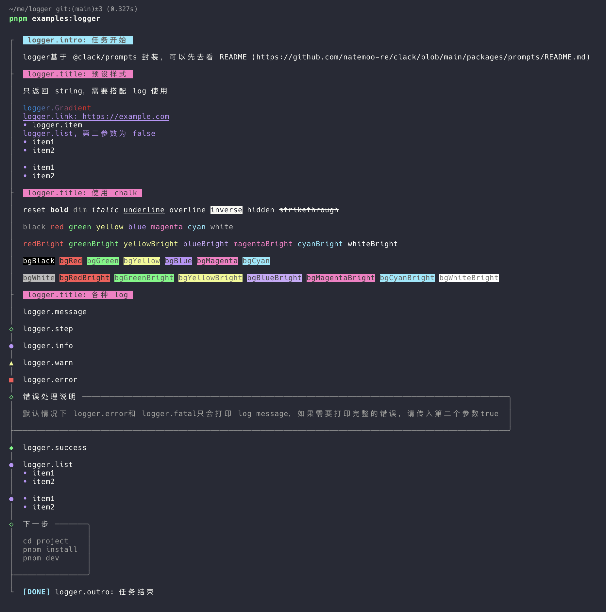
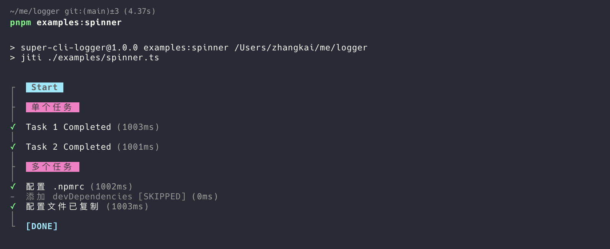
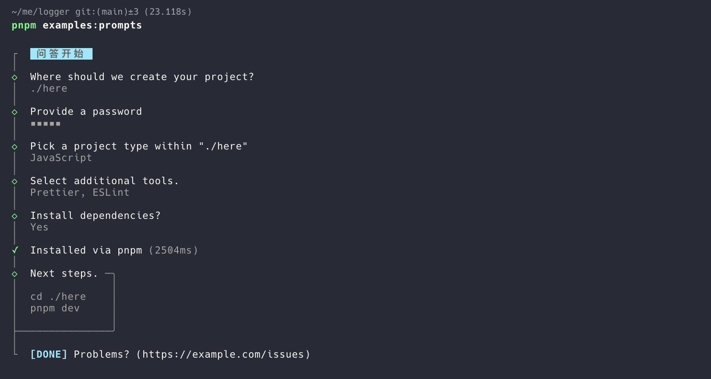

# super-cli-logger

[@clack/prompts](https://github.com/bombshell-dev/clack/tree/main/packages/prompts) 的个人优化版本：
- 整合了 `@clack/core` 和 `chalk`
- 解决了中文的显示问题
- 优化了一些用法
- 类型更友好

## Installation

```bash
pnpm add super-cli-logger
```

## Usage

运行命令查看用法

```bash
pnpm examples:logger
pnpm examples:prompts
pnpm examples:spinner
```

prompts api 参考：[@clack/prompts](https://github.com/bombshell-dev/clack/tree/main/packages/prompts)




